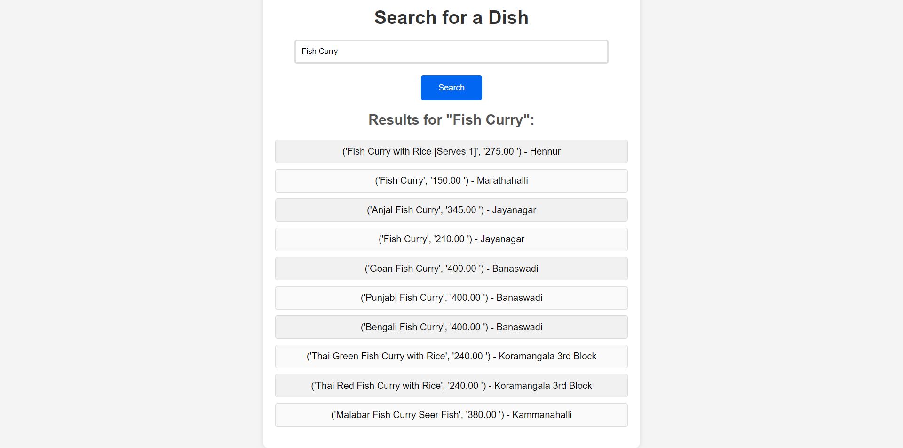

# Restaurant Dish Search App

Welcome to the Restaurant Dish Search App! This Django-based web application allows users to search for restaurant dishes by name. The application provides an intuitive search interface and displays the results in a user-friendly manner.

## Table of Contents

- [Introduction](#introduction)
- [Features](#features)
- [Installation](#installation)
- [Usage](#usage)
- [Contributing](#contributing)
- [License](#license)

## Introduction

The Restaurant Dish Search App is designed to make it easy for users to find dishes from various restaurants. It leverages Django's powerful ORM to manage restaurant data and provides a simple yet effective search functionality.

## Features

- **Search Functionality:** Users can search for dishes by name.
- **User-Friendly Interface:** A clean and responsive design ensures a smooth user experience.
- **Data Management:** Efficiently handles restaurant data with Django models.

## Installation

### Prerequisites

- Python 3.7+
- Django 3.2+
- Virtualenv (recommended)

### Steps

1. **Clone the repository:**
   ```sh
   git clone https://github.com/atulguptag/Django-Search-Application
   cd restaurant_search
   ```

2. **Create and activate a virtual environment:**
   ```sh
   python -m venv venv
   venv\Scripts\activate  # On Windows

   source venv/bin/activate # On linux
   ```

3. **Install the required packages:**
   ```sh
   pip install -r requirements.txt
   ```

4. **Set up the database:**
   ```sh
   python manage.py makemigrations
   python manage.py migrate
   ```

5. **Load the initial data:**
   ```sh
   python manage.py load_data initial_data.json
   ```

6. **Run the development server:**
   ```sh
   python manage.py runserver
   ```

7. **Access the application:**
   Open your browser and go to `http://127.0.0.1:8000/`.

## Usage

### Searching for Dishes

- **Homepage:** Visit the homepage to find the search bar.
- **Enter Dish Name:** Type in the name of the dish you are looking for.
- **View Results:** The app will display a list of matching dishes with their locations.

### Example Search



## Contributing

We welcome contributions from the community! To contribute:

1. Fork the repository.
2. Create a new branch (`git checkout -b feature-branch`).
3. Make your changes.
4. Commit your changes (`git commit -m 'Add new feature'`).
5. Push to the branch (`git push origin feature-branch`).
6. Create a new Pull Request.

## License

This project is licensed under the MIT License. See the [LICENSE](LICENSE) file for more details.

---
Made with ❤️ by [Atul Gupta](https://github.com/atulguptag)